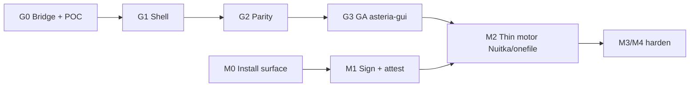

# Asteria Dual-Track Roadmap — Motor Hardening + Separated GUI

> Tarih: 2026-07-25  
> Client: **4.9.34** · Contract: **1.4.31** · Brand: **Asteria** (`asteria.run`)  
> Durum: **aktif plan** — uygulama fazlara bağlı  
> İlgili: [`GUI_WEBVIEW_ROADMAP.md`](GUI_WEBVIEW_ROADMAP.md) ·  
> [`SECURITY_RESILIENCE_ROADMAP.md`](SECURITY_RESILIENCE_ROADMAP.md) ·  
> contract `agent/gui-control-center.md` · `cloud/PRODUCT_BRANDING.md`

Bu belge **iki işi birlikte** yönetir:

1. **Track M — Motor güvenliği** (sistem katmanı ajan / `asteria-client.exe`)  
2. **Track G — Ayrı GUI** (`asteria-gui.exe` · WebView2 + React · seçici WebGL)

Amaç: GUI yükünü ve yüzeyini motordan ayırarak motoru ince, imzalı ve
sektördeki endpoint ajanlarına **yakın güvenlik seviyesinde** tutmak;
kullanıcıya modern Asteria arayüzü vermek.

---

## 0. Gerçekçilik (ürün vaadi)

### Sektör ne yapıyor? (AV / EDR / deception ajanları)

| Katman | Tipik pratik | Asteria karşılığı |
|--------|--------------|-------------------|
| Kod dili | Kritik yol çoğunlukla **native** (C/C++) | Track M: Python → **Nuitka/native** PoC; uzun vadede ince native core |
| Paket | Tek/az binary; runtime DLL’ler gizli veya imzalı | **Tek motor exe**; `_internal` kullanıcıya açık olmamalı |
| İmza | Authenticode (ideal EV) | Zorunlu production imza; soft-skip kaldırılır |
| Bütünlük | Hash allowlist + cloud attestation | Boot + update + heartbeat’te hash/imza; cloud reject |
| Sırlar | Policy/intel cloud’da | Zaten yönümüz; GUI’ye token yazılmaz |
| Süreç | Servis + watchdog; bazılarında PPL/ELAM | Guardian + watchdog var; **PPL Microsoft attestation ister** — PoC/`[A]`, garanti değil |
| UI | Ayrı süreç (user session) | **`asteria-gui.exe`** — elevated değil |
| Veri | ProgramData / protected store | Program Files’ta **log/veri yok** |

### Ne vaat ederiz / etmeyiz

| Vaat | |
|------|--|
| Evet | Program Files temiz yüzey; tek imzalı motor; GUI ayrı ve ince; patch/sahte exe cloud’da reddedilir; casual reverse pahalı |
| Hayır | “Exe asla çözülemez” — Windows’ta çalışan her binary incelenebilir. Güvenlik = **maliyet + attestation + cloud SoT**, sihirli kilit değil |

Mevcut güvenlik ilkesi (değişmez): *“Mimari bilinse de güvenli kalmalıdır.”*
Binary obfuscation ek maliyet katmanıdır; tek kontrol değildir
(`SECURITY_RESILIENCE_ROADMAP.md`).

---

## 1. Hedef mimari (son durum)

```
 Interactive session (user)
 ┌─────────────────────────┐     localhost IPC :58632
 │  asteria-gui.exe        │◄──────────────────────────┐
 │  WebView2 + React UI    │   (allowlist bridge)      │
 │  optional WebGL viz     │                           │
 │  no token in JS         │                           │
 └───────────┬─────────────┘                           │
             │ Show / Quit                             │
 ┌───────────▼─────────────┐                           │
 │  Tray (pystray / thin)  │                           │
 │  same user session      │                           │
 └─────────────────────────┘                           │
                                                       │
 SYSTEM / service session                              │
 ┌─────────────────────────────────────────────────────▼──┐
 │  asteria-client.exe  (MOTOR)                           │
 │  honeypots · firewall AR-* · control-WS · threat apply │
 │  Authenticode + self-integrity + path trust            │
 │  NO GUI toolkit · NO WebView                           │
 └──────────────────────────┬─────────────────────────────┘
                            │ HTTPS/WSS
                            ▼
                     asteria.run (cloud SoT)
```

**Kurulum yüzeyi (Program Files\Asteria\…):**

| Dosya | Rol |
|-------|-----|
| `asteria-client.exe` | Motor (SYSTEM) |
| `asteria-gui.exe` | UI (interactive) |
| `Uninstall.exe` | NSIS |
| *(opsiyonel)* `asteria-tray` host | Tray GUI ile birleşebilir |

**Yasak Program Files’ta:** uygulama logları, token, config cache, threat DB.  
Hepsi: `%ProgramData%\YesNext\CloudHoneypotClient\` (wire; migrate ayrı iş).

---

## 2. Track M — Motor hardening

Durum: `[ ]` plan · `[~]` kısmi · `[x]` bitti · `[A]` araştırma

### M0 — Kurulum yüzeyi (hemen / 4.9.x–4.10)

| # | İş | Çıktı | Durum |
|---|-----|--------|--------|
| M0.1 | Program Files ACL: Users read-only exe; yazma yok | Installer icacls | `[~]` scripts ACL var; kök sıkılaştır |
| M0.2 | `_internal` kullanıcıya kapalı **veya** kaldır | ACL-first interim → onefile/Nuitka | `[ ]` |
| M0.3 | Build gate: `client_*.py` sızıntı yok | `build.ps1` gate | `[x]` 4.9.25 |
| M0.4 | Kill/update helper’lar Program Files’ta yok | NSIS PLUGINSDIR | `[x]` 4.9.24 |
| M0.5 | Log/veri yalnız ProgramData | dokümante + audit | `[~]` |

**Çıkış:** Explorer’da “kaynak klasörü” hissi yok; standart kullanıcı motor dosyalarını değiştiremez.

### M1 — İmza, bütünlük, attestation (4.10)

| # | İş | Çıkış |
|---|-----|--------|
| M1.1 | Production’da Authenticode **zorunlu** (soft-skip kapat) | Update + boot |
| M1.2 | Motor boot: imza + hash self-check → resilience snapshot | `binary_integrity` |
| M1.3 | Cloud: bilinen release hash allowlist / reject unknown | contract + cloud |
| M1.4 | Self-update yalnız imzalı + hash eşleşen installer | mevcut path sertleştir |
| M1.5 | SBOM / provenance JSON her release | zaten kısmen var |

**Çıkış:** İmzasız / patch’li / sahte exe filo register/heartbeat’te reddedilir veya quarantine.

### M2 — Derleme modeli (motor inceken)

| # | İş | Not | Durum |
|---|-----|-----|--------|
| M2.1 | GUI ayrılınca motor **onefile veya Nuitka** PoC | Lab: boot, update, WebRTC, Defender FP | `[A]`→`[ ]` |
| M2.2 | Motor build’den CTk / WebView / React **exclude** | Boyut ↓, yüzey ↓ | Track G’ye bağlı |
| M2.3 | Reproducible / pinned deps | False-positive azaltır | `[ ]` |
| M2.4 | PyArmor / agresif anti-debug | **Yapılmaz** (AV FP) — mevcut politika | `[X]` |

**Çıkış:** Lab’da tek motor binary; update yolu FileInUse’suz; Defender FP kabul edilebilir.

### M3 — Runtime tamper (mevcut + sertleştir)

| # | İş | Durum |
|---|-----|--------|
| M3.1 | Guardian + Watchdog + SCM recovery | `[x]` |
| M3.2 | Process DACL / tamper wire / operator-stop | `[x]` |
| M3.3 | ACL drift audit → alert | `[~]` |
| M3.4 | PPL / ELAM / signed mini-filter | `[A]` — Microsoft maliyeti; ürün kararı sonra |
| M3.5 | Secrets/policy cloud SoT; client cache imzalı | `[~]` defense_policy vb. |

### M4 — Sırlar ve reverse maliyeti

| # | İş |
|---|-----|
| M4.1 | Threat scoring / intel / defense matrix cloud’da büyür |
| M4.2 | Release secret scan CI (gömülü key yok) |
| M4.3 | Verbose internal string/log temizliği production |
| M4.4 | “Banner/endpoint gizle = güvenlik” **yok** — TLS + auth |

---

## 3. Track G — Ayrı GUI (`asteria-gui.exe`)

Detay parity: [`GUI_WEBVIEW_ROADMAP.md`](GUI_WEBVIEW_ROADMAP.md).  
Bu track’te **paketleme kararı güncellendi:** gömülü host değil, **ayrı exe**.

### G0 — Sözleşme & POC (4.9.x lab)

| # | İş | Çıktı | Durum |
|---|-----|--------|--------|
| G0.1 | Bridge SoT taslağı | contract `agent/gui-webview-bridge.md` | `[ ]` |
| G0.2 | `gui-control-center.md` → ayrı process notu | contract bump | `[ ]` |
| G0.3 | Design tokens (dashboard sync) | `docs/design/tokens.md` | `[ ]` |
| G0.4 | POC: `asteria-gui.exe` boş WebView + `PING`/`STATUS` | spike | `[ ]` |
| G0.5 | IPC auth: yalnız local + optional shared secret / named pipe ACLs | taslak | `[ ]` |

**Çıkış:** Tray “Show” → `asteria-gui.exe`; motor CTk’siz STATUS döner.

### G1 — Shell (4.10-beta)

| # | İş |
|---|-----|
| G1.1 | `ui/` Vite + React + TS |
| G1.2 | `asteria-gui` host (Python thin **veya** küçük native host) |
| G1.3 | Chrome: sidebar, toast, i18n, PIN (host doğrular) |
| G1.4 | Feature flag: `ASTERIA_UI=gui_exe|ctk|off` |
| G1.5 | NSIS: iki exe + WebView2 Evergreen bootstrapper |

### G2 — Sayfa parity

Sıra (GUI roadmap §6 Faz 2 ile aynı): Status → IP → Services → Layers → Settings → Threat (+ RD panel).

### G3 — WebGL + GA

- Canvas default; WebGL opt-in (heatmap / live feed)  
- CTk kaldır; default `asteria-gui.exe`  
- E2E smoke  

### G4 — Motor incelme kilidi

GUI GA sonrası Track **M2** (Nuitka/onefile motor) açılır — GUI DLL/toolkit motor binary’sinde yok.

---

## 4. Ortak faz takvimi (öneri)

| Dilim | Motor (M) | GUI (G) | Sürüm bandı |
|-------|-----------|---------|-------------|
| **Now** | M0 ACL + yüzey audit | G0 bridge + POC kararı | 4.9.x lab |
| **Sprint A** | M0.2 interim ACL `_internal` | G0.4 WebView POC ayrı process | 4.9.35+ internal |
| **Sprint B** | M1.1–M1.3 imza/attestation | G1 shell + Status live | 4.10.0-beta |
| **Sprint C** | M1 complete | G2 parity 3 sayfa | 4.10.x |
| **Sprint D** | M2 Nuitka/onefile PoC (GUI ayrılmış) | G2 tamam | 4.10.x–4.11 |
| **GA** | M2 production motor | G3 default GUI exe | **4.11.0** |

Sürüm numaraları esnek; her public dilimde contract + CHANGELOG.

---

## 5. Bağımlılıklar (sıra kilitleri)



**Kritik:** Nuitka/onefile motor **GUI ayrılmadan** zorlanır (CTk + WebRTC + GUI = şişman, kırılgan). Önce G, sonra M2.

---

## 6. Repo / artifact hedefi

```
asteria-client/                 # GitHub: cevdetaksac/asteria-client
  asteria-client.spec           # MOTOR only (post-split)
  asteria-gui.spec              # GUI host + ui/dist
  ui/                           # React + Vite
  client_webview_host.py        # veya gui/ paket
  docs/
    ASTERIA_DUAL_TRACK_ROADMAP.md   # bu belge
    GUI_WEBVIEW_ROADMAP.md          # UI detay / parity
asteria-contract/
  agent/gui-webview-bridge.md
  agent/gui-control-center.md       # process split notları
```

Installer çıktısı: `asteria-setup.exe` → motor + gui + uninstall.

---

## 7. Güvenlik kuralları (her iki track)

1. GUI **asla** honeypot / firewall / control-WS sahibi olmaz.  
2. Token, PIN hash, machine_id JS’e yazılmaz.  
3. WebView yalnız local app origin; DevTools prod kapalı.  
4. IPC allowlist; yeni komut → contract + test.  
5. Motor Authenticode + path trust; GUI ayrı imzalanır.  
6. Program Files’ta state yok.  
7. Obfuscator/packer AV riski → yalnız ölçümlü Nuitka; PyArmor yok.

---

## 8. Başarı metrikleri

| Metrik | Hedef |
|--------|--------|
| Program Files girişleri | ≤ 3 anlamlı binary (+ uninstall) |
| Standart kullanıcı `_internal` okuma | Red / yok |
| İmzasız motor heartbeat | Cloud reject veya quarantine |
| GUI crash | Motor ve honeypot ayakta |
| Motor binary boyutu (GUI ayrılınca) | Ölçülür; CTk öncesi −%30+ hedef |
| Casual pyinstxtractor | Anlamlı kaynak yok / native |

---

## 9. Bilinçli kapsam dışı

- Kernel mini-filter’ı “hemen” yazmak  
- “Çözülemez exe” pazarlama iddiası  
- Electron  
- GUI’yi Session-0’da çalıştırmak  
- ProgramData wire path’ini sessizce Asteria’ya taşımak (ayrı migrate MD)

---

## 10. Sonraki somut adımlar (onaylı ilerleme)

**Bu hafta (paralel):**

1. **G0.1** — `gui-webview-bridge.md` taslağını contract’a yaz (draft → sonra VERSION bump).  
2. **G0.4** — Ayrı process POC iskeleti (`--mode=gui` → ileride `asteria-gui.exe`).  
3. **M0.1–M0.2** — Installer’da `_internal` (+ kök) ACL: Users list/read kaldır veya deny; SYSTEM+Admins full.  
4. Bu belgeyi `README` / `AGENTS` pointer ile bağla.

**Bloklayanlar:** Authenticode sertifika (M1), dashboard token erişimi (G0.3), lab makinesi WebView2.

---

## Durum özeti

| Track | Faz | Durum |
|-------|-----|--------|
| M | M0 yüzey | `[~]` |
| M | M1 imza/attest | `[ ]` |
| M | M2 Nuitka/onefile | `[A]` (G3 sonrası) |
| G | G0 sözleşme/POC | `[ ]` |
| G | G1–G3 | `[ ]` (detay GUI roadmap) |
